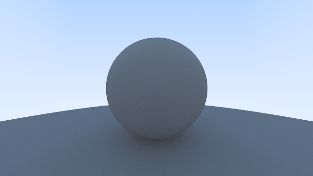

# Raytracer0
Raytracer0 is a TypeScript raytracer I built to learn the fundamentals of raytracing.

## Credits
- [Ray Tracing in One Weekend](https://raytracing.github.io/books/RayTracingInOneWeekend.html)
- [The Cherno](https://www.youtube.com/@TheCherno)
- [Sebastian Lague](https://www.youtube.com/@SebastianLague)
- [Tim Babb](https://en.wikipedia.org/wiki/Ray_tracing_(graphics)#/media/File:Recursive_raytrace_of_a_sphere.png)
    - Link to license: [CC BY-SA 4.0](https://creativecommons.org/licenses/by-sa/4.0/)
    - No changes were made.

## Renders
Simple gray diffuse sphere on a larger sphere:

## Notes
- The raytracer will not draw the last row or column of the image for convenience reasons.

## License
[MIT](https://choosealicense.com/licenses/mit/)